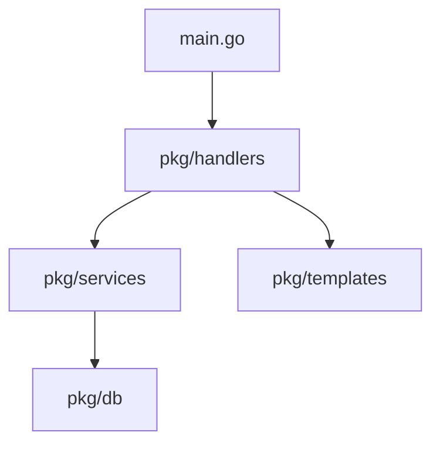

# The Goat Stack 🐐

The Goat stack is a tech stack that uses the following technologies:

- [**T**empl](https://templ.guide) to render html templates
- [**H**tmx](https://htmx.org) to make html interactive
- [**E**cho](https://echo.labstack.com) to handle http requests
- [**Go**](https://go.dev) as the backend language
- [**A**ir](https://github.com/cosmtrek/air) for live reloading
- [**T**ailwind](https://tailwindcss.com) for styling

## Get Started

1. Install the Goat CLI: `go install github.com/norbusonam/the-goat-stack/cmd/goat@latest`
2. Create a new project: `goat new`

## Application Architecture

**Heavily** inspired by [templ's documentation](https://templ.guide/project-structure/project-structure#application-architecture) ❤️

