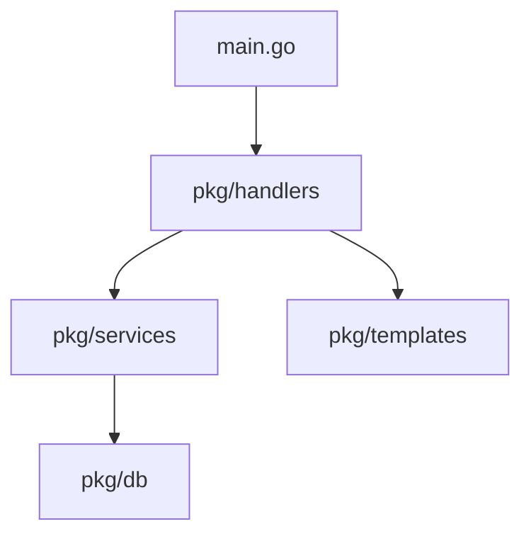

# thegoat 🐐

**thegoat** is a tech stack that uses the following technologies:

- [**T**empl](https://templ.guide)
- [**H**tmx](https://htmx.org)
- [**E**cho](https://echo.labstack.com)
- [**Go**](https://go.dev)
- [**A**ir](https://github.com/cosmtrek/air)
- [**T**ailwind](https://tailwindcss.com)

## application architecture

**Heavily** inspired by [templ's documentation](https://templ.guide/project-structure/project-structure#application-architecture) ❤️

